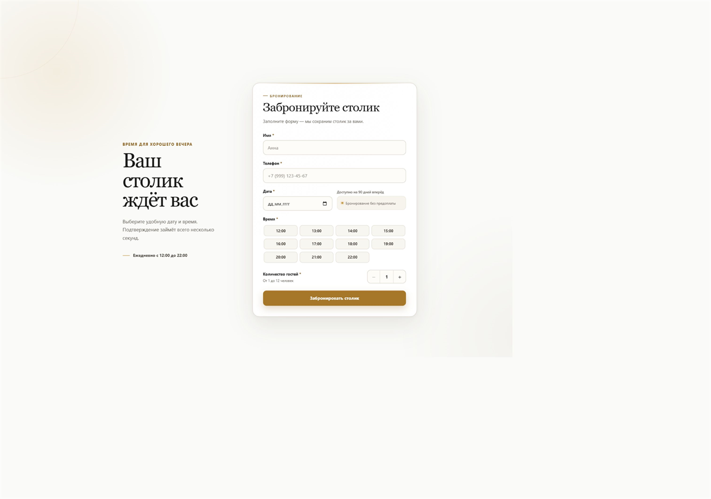
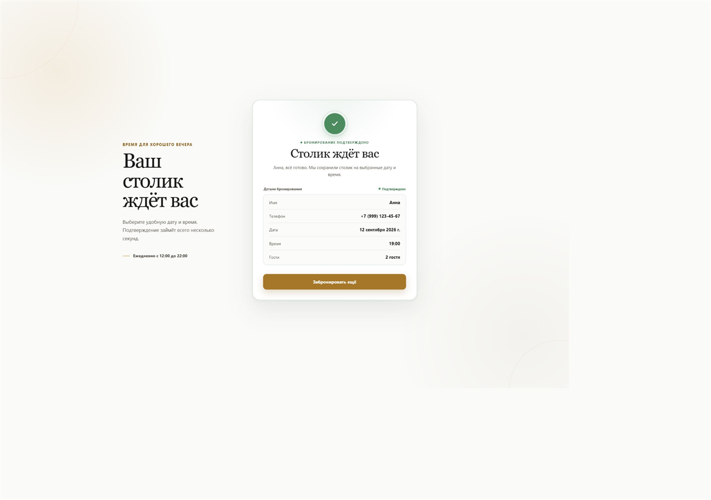
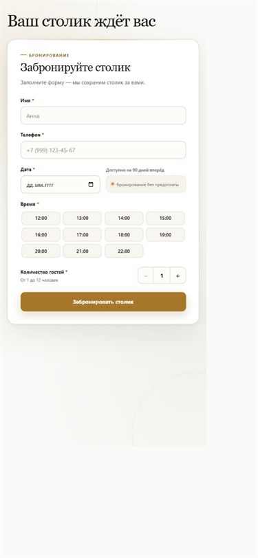
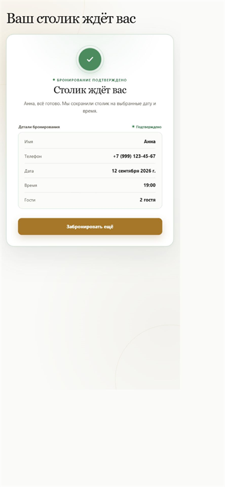

# Бронирование столика

Небольшая страница бронирования столика на Nuxt 3, Vue 3 и TypeScript. Форма проверяет данные, имитирует отправку и показывает подтверждение.

## Запуск

```bash
npm install
npm run dev
```

Открыть: `http://localhost:3000`.

## Решения

Логика формы вынесена в composable, а типы лежат отдельно. Форма и экран подтверждения разделены на компоненты. Переход между экранами сделан через Vue Transition. Для стилей используются SCSS Modules.

## Что бы доделал

При наличии времени добавил бы e2e-тесты основного сценария.

## Интерфейс

### Desktop

Форма бронирования



Успешное бронирование



### Mobile

Форма бронирования



Успешное бронирование


